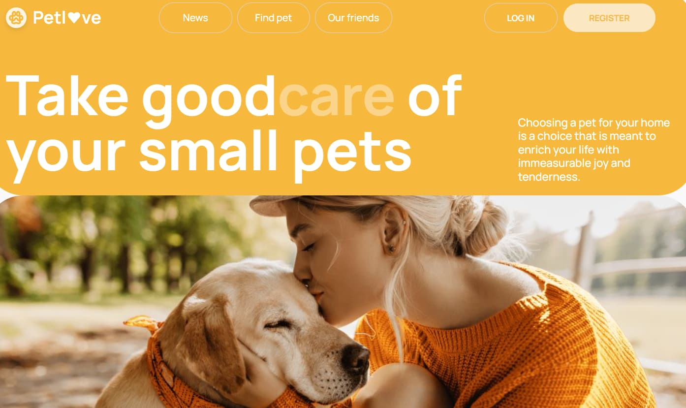
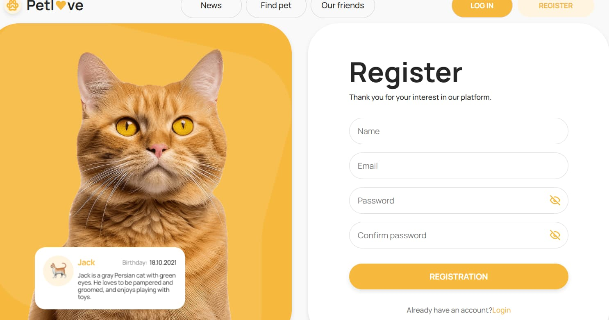
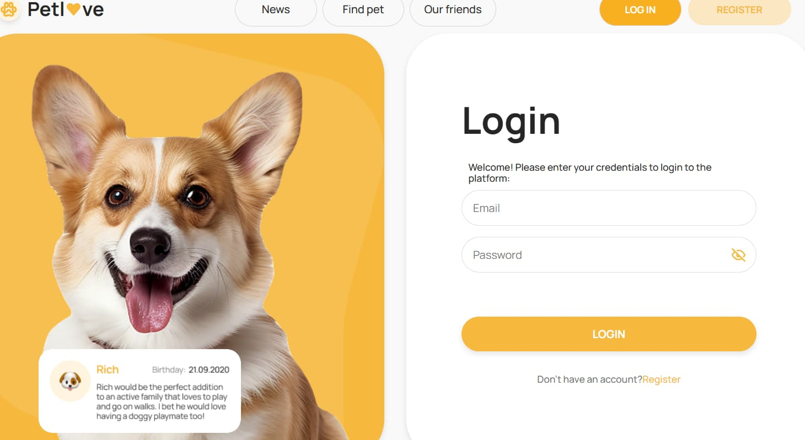
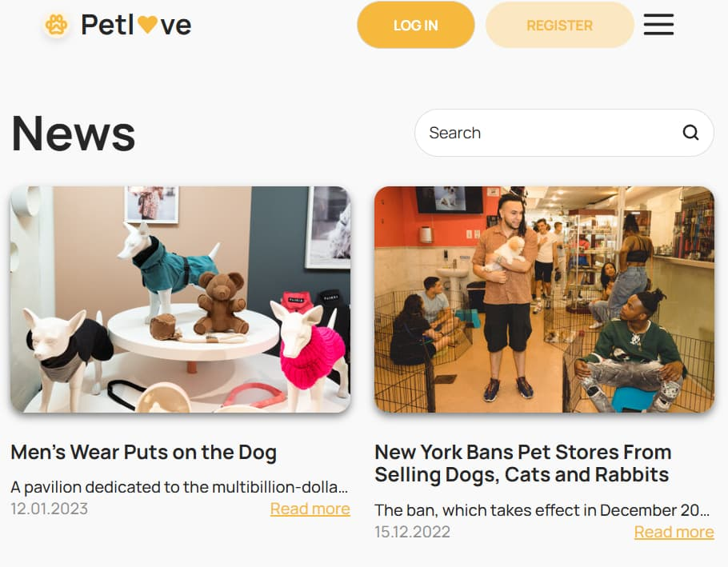
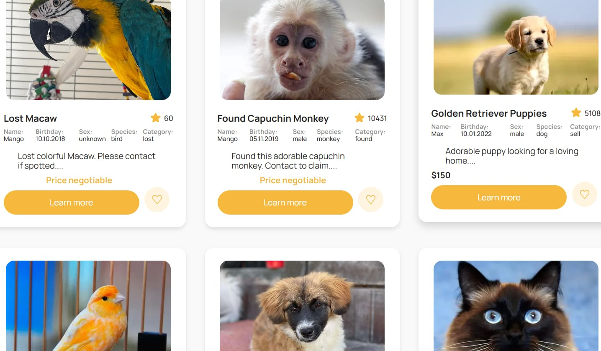
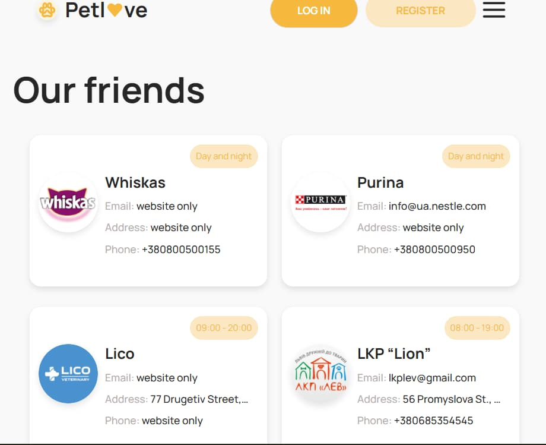
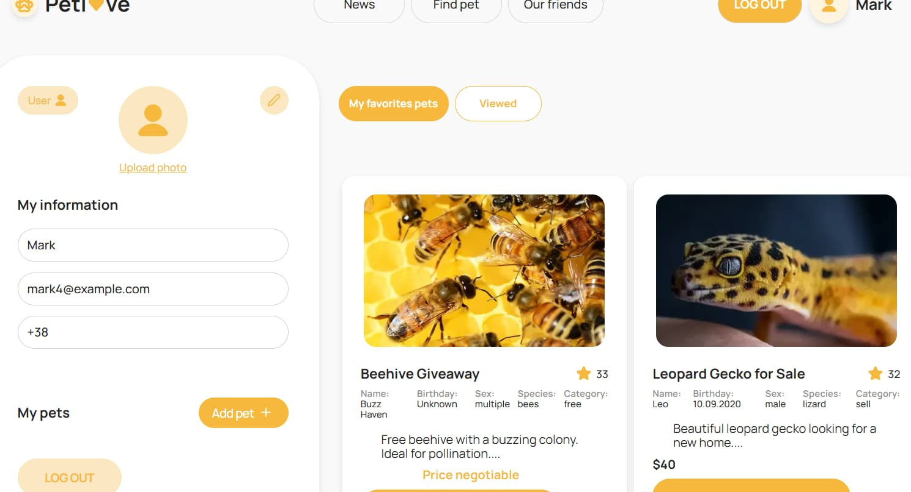

# React + Vite

# Petl💛ove - Platform for owners and their pets

PetFinder is a convenient service for all animal lovers. Here you can:

- **find a lost pet or post a missing notice**
- **list an advertisement for selling**
- **adopt a pet from a shelter or buying**
- **find out news about animals**
- **additional information of companies,shelters and medical institution**

## 📷 Gallery

  
  
  
  
  
  
  
  
  

<h1>Petl💛ve</h1>

📄 The application includes <strong>11 pages:</strong>

<table>
  <tr>
    <th>Main Pages</th>
    <th>Additional Pages</th>
    <th>Other Pages</th>
  </tr>
  <tr>
    <td>Main</td>
    <td>News</td>
    <td>Profile</td>
  </tr>
  <tr>
    <td>Home</td>
    <td>Pets</td>
    <td>Views</td>
  </tr>
  <tr>
    <td>Register</td>
    <td>Add Pet</td>
    <td>Favorites</td>
  </tr>
  <tr>
    <td>Login</td>
    <td>Our Friends</td>
    <td></td>
  </tr>
</table>

<h2>Additional Modal Windows</h2>
<table>
  <tr>
    <th>Confirmation Windows</th>
    <th>Informational Windows</th>
  </tr>
  <tr>
    <td>Approve</td>
    <td>Attention</td>
  </tr>
  <tr>
    <td>Edit User</td>
    <td>Pets Details</td>
  </tr>
</table>

<h2>Additional Features</h2>
<ul>
  <li> <strong>Mobile menu</strong> for easy navigation</li>
  <li> <strong>Responsive design</strong> with <strong>three fixed breakpoints</strong></li>
</ul>

## ⚙️ Technologies and Libraries

The application incorporates key libraries for state management, validation,
routing, and UI enhancement:

- **@reduxjs/toolkit** – managing state in Redux
- **axios** – handling HTTP requests
- **react-router-dom** – routing in the React application
- **redux-persist** – state persistence across sessions
- **yup** – form validation
- **clsx** – dynamic class change
- **react-circular-progressbar** – progress bar for UI
- **react-toastify** – notifications
- **modern-normalize** – CSS normalization cross-browser compatibility

Other dependencies ensure stability and optimization of the application.

---
